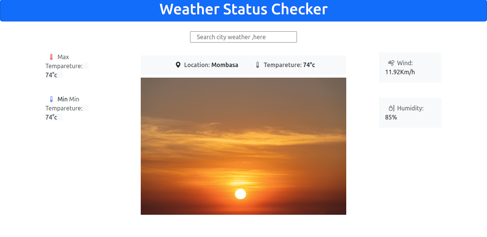

# WeatherApp

This a website application is used to identify the weather location of various cities around the globe.

## BDD

On load , a form to key location for search weather status,default location weather status
On search, retrive weather status of the location

## Website Layout

## Language used

- Angular
- Bootstrap
- Consuming Rapid API -
  [Open Weather API](https://rapidapi.com/worldapi/api/open-weather13/pricing)

- - This project was generated with [Angular CLI](https://github.com/angular/angular-cli) version 14.0.1.

## Development server

Run `ng serve` for a dev server. Navigate to `http://localhost:4200/`. The application will automatically reload if you change any of the source files.
